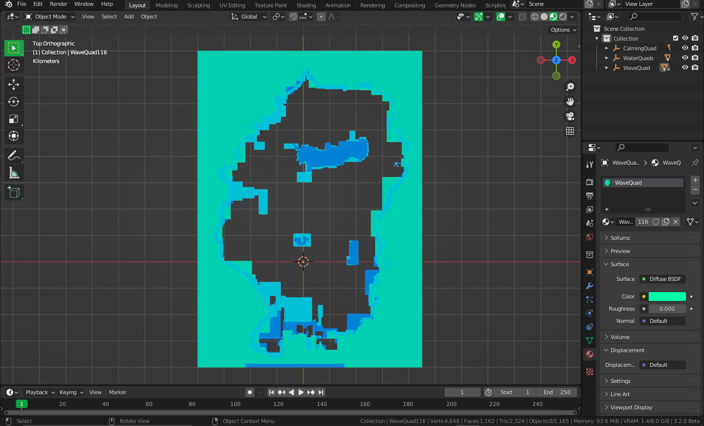

# GTAV Water Editor

Blender addon to import/export GTAV water.xml

## IMPORTANT
Water quads in GTAV work in a very odd way and sometimes changes made to water quads may or may not be reflected properly in-game due to its miscellaneous behaviour.

## Installation
- Download the repository as ZIP!
- Open Blender
- Click menu `File > User Preferences...`
- Activate the `Addons` section
- Click `Install...` button at the top
- Select the downloaded ZIP
- Find `WaterEditor` in the addon list and enable it
- Press N in viewport to open the panel

## USAGE
- Delete Quad to remove it
- In order to modify or create a new quad, duplicate any existing quad
- Resize it and move it to desired location
- Press `Ctrl+A` > `Apply All Transforms`
- Press Export button to export with all the changes

## CREDITS
- [Sollumz](https://github.com/Skylumz/Sollumz) for its XML parser
- [Alebalweb Blog](https://www.alebalweb-blog.com/22-tutorial-add-modify-water-in-gta-5-water-xml.html) for its documented research on water.xml

**If you liked this addon, consider supporting me:**
